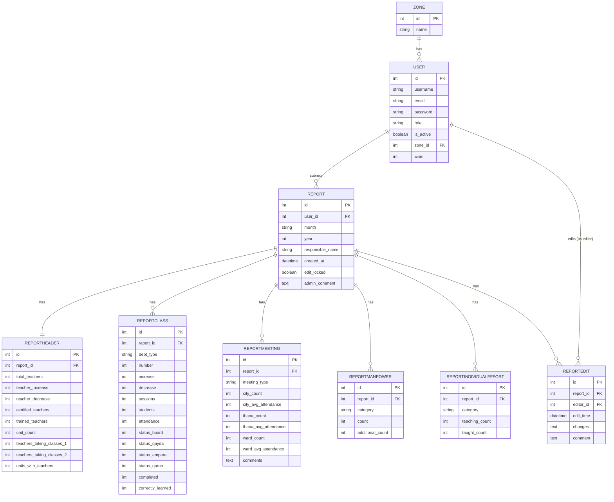

# Database Tables and Columns (Visual Table Only)

---

# Entity-Relationship Diagram (Mermaid)

---

# System Workflow (All Roles)

---

# Database Tables, Columns, and Relationships

## Zone

- id (PK): Integer
- name: String (unique, not null)
- users: Relationship to User (one-to-many)

## User

- id (PK): Integer
- username: String (unique, nullable)
- email: String (unique, not null)
- password: String (not null)
- role: String (user/admin, not null)
- is_active: Boolean (default False)
- zone_id (FK): Integer → Zone.id
- ward: Integer (not null)
- reports: Relationship to Report (one-to-many, via user_id)

## Report

- id (PK): Integer
- user_id (FK): Integer → User.id
- month: String (not null)
- year: Integer (not null)
- responsible_name: String (not null)
- created_at: DateTime (default now)
- edit_locked: Boolean (default False)
- admin_comment: Text (nullable)
- header: Relationship to ReportHeader (one-to-one, via report_id)
- classes: Relationship to ReportClass (one-to-many, via report_id)
- meetings: Relationship to ReportMeeting (one-to-many, via report_id)
- manpower: Relationship to ReportManpower (one-to-many, via report_id)
- efforts: Relationship to ReportIndividualEffort (one-to-many, via report_id)
- edits: Relationship to ReportEdit (one-to-many, via report_id)

## ReportHeader

- id (PK): Integer
- report_id (FK): Integer → Report.id
- total_teachers: Integer
- teacher_increase: Integer
- teacher_decrease: Integer
- certified_teachers: Integer
- trained_teachers: Integer
- unit_count: Integer
- teachers_taking_classes_1: Integer
- teachers_taking_classes_2: Integer
- units_with_teachers: Integer

## ReportClass

- id (PK): Integer
- report_id (FK): Integer → Report.id
- dept_type: String
- number: Integer
- increase: Integer
- decrease: Integer
- sessions: Integer
- students: Integer
- attendance: Integer
- status_board: Integer
- status_qayda: Integer
- status_ampara: Integer
- status_quran: Integer
- completed: Integer
- correctly_learned: Integer

## ReportMeeting

- id (PK): Integer
- report_id (FK): Integer → Report.id
- meeting_type: String
- city_count: Integer
- city_avg_attendance: Integer
- thana_count: Integer
- thana_avg_attendance: Integer
- ward_count: Integer
- ward_avg_attendance: Integer
- comments: Text (nullable)

## ReportManpower

- id (PK): Integer
- report_id (FK): Integer → Report.id
- category: String
- count: Integer
- additional_count: Integer (nullable)

## ReportIndividualEffort

- id (PK): Integer
- report_id (FK): Integer → Report.id
- category: String
- teaching_count: Integer
- taught_count: Integer

## ReportEdit (Audit Trail)

- id (PK): Integer
- report_id (FK): Integer → Report.id
- editor_id (FK): Integer → User.id
- edit_time: DateTime (default now)
- changes: Text (JSON string)
- comment: Text (nullable)

# Relationships Summary

- Zone 1---* User
- User 1---* Report
- Report 1---1 ReportHeader
- Report 1---* ReportClass
- Report 1---* ReportMeeting
- Report 1---* ReportManpower
- Report 1---* ReportIndividualEffort
- Report 1---* ReportEdit
- User 1---* ReportEdit (as editor)