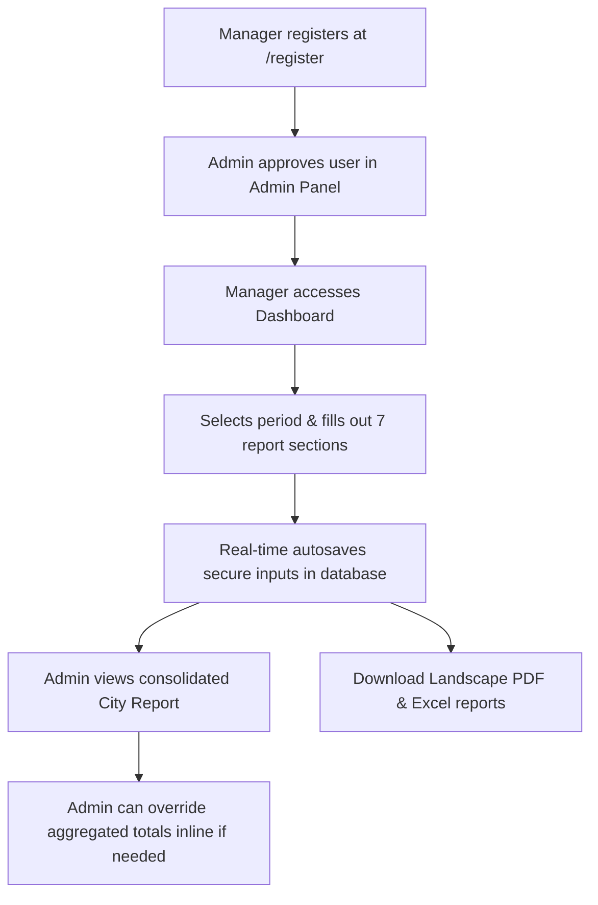

# 📊 Report Submission System (রিপোর্ট সাবমিশন সিস্টেম)

[](https://opensource.org/licenses/MIT)
[](https://nextjs.org/)
[](https://tailwindcss.com/)
[](https://supabase.com/)
[](https://www.typescriptlang.org)

An enterprise-ready, high-fidelity reporting and analytics platform designed specifically for organizational monitoring, multi-period zone assessments, and consolidated city-wide data aggregation.

This system modernizes legacy reporting workflows into a fast, beautiful, secure, and mobile-first web application supporting **5 temporal reporting periods** (Monthly, Quarterly, Half-Yearly, Nine-Month, and Yearly).

---

## ✨ Core Advantages (Pros)

- **⚡ Zero-Latency Autosave**: Never lose progress. Data is auto-saved locally and synced to the cloud as soon as a user shifts focus from a field (`onBlur`), backed by instant success feedback.
- **🔄 Atomic Transactional Initialization**: Uses PostgreSQL RPC (`get_or_create_report`) to atomically seed root reports and 7 child tables (50+ categories) in a single database transaction, reducing network requests from 8 to 1 and eliminating client-side race conditions.
- **🛡️ Infinite Scalability & Anti-Enumeration Auth**: Registration validation queries database-indexed profiles synchronized via PostgreSQL triggers (`on_auth_user_created`), bypassing the 1,000-user API cap (ADR 003). GoTrue silent email collision guards (`identities: []`) prevent enumeration attacks.
- **🎨 Modern 4-Theme Suite**: Features four meticulously designed themes—**Light**, **Dark**, **Solarized Light**, and **Solarized Dark**—catering to both standard preferences and high-contrast, low-strain environments.
- **🌐 Seamless Zero-Refresh Dual-Language UI**: Toggle between **Bengali (বাংলা)** and **English** instantly. The entire interface translates dynamically via React Context without page refreshes or route pushes.
- **🚀 Ultra-Fast Database Aggregations**: By offloading complex multi-zone calculations to **PostgreSQL Views** at the database storage layer, the frontend renders city-wide reports instantly without heavy client-side computation.
- **🔒 Granular Row Level Security (RLS)**: Core data access is protected directly inside PostgreSQL. Managers can only view and update their own zones, while administrators retain global read, override, and user approval privileges.
- **📄 Landscape 2-Page PDF & Excel Exports**: Engineered in landscape orientation to display comprehensive multi-column metrics cleanly across a maximum of two A4 pages, utilizing universal **Kalpurush** typography to guarantee zero rendering crashes.
- **📱 Mobile-First Responsive Architecture**: Adheres to touch-first ergonomics (minimum 44x44px touch targets) with sticky desktop tables that transform into swipeable step-by-step cards and a fixed bottom navigation bar on mobile devices.
- **💾 Automated Zero-Cost Cloud Backups**: In addition to Supabase managed backups, an automated GitHub Actions cron workflow (`.github/workflows/backup.yml`) executes encrypted `pg_dump` backups committed to a secure private repository.

---

## 🛠️ How It Works



### 1. Registration & Security Gate
New users register with email or a custom User ID. Next.js middleware enforces an **approval gate** (`active = false`)—new accounts remain in a pending state at `/pending-approval` and cannot view reports until explicitly activated by an administrator in `/admin/users`.

### 2. Guided Multi-Period Dashboard Navigation
The platform supports **5 temporal reporting periods**: Monthly (**মাসিক**), Quarterly (**ত্রৈমাসিক**), Half-Yearly (**ষান্মাসিক**), Nine-Month (**নয়-মাসিক**), and Yearly (**বার্ষিক**). The dashboard breaks reports down into seven key sections (Basic Info, Courses, Organizational, Personal, Meetings, Maktab/Travel, and Comments) for guided, modular data entry.

### 3. Desktop Grids & Mobile Cards
Data input fields adapt dynamically to the screen size following strict WCAG touch ergonomics. On desktops (`>= 1024px`), fields are structured into clean tabular grids; on mobile devices (`< 1024px`), inputs are grouped into step-by-step swipeable cards with a fixed bottom navigation bar for thumb-friendly navigation.

### 4. Consolidated Reporting & Exports
Once zone reports are collected, administrators can access a unified city-wide report powered by PostgreSQL aggregation views with inline correction capabilities (`city_report_overrides`). The interface supports downloading condensed, print-ready Excel and **Landscape PDF** files formatted with Kalpurush typography for offline presentation.

---

## 💻 Tech Stack

- **Frontend**: Next.js 15+ (App Router), React 19 & TypeScript 5.x
- **Styling**: Tailwind CSS v4, custom HSL color tokens & Glassmorphism UI
- **Database & Auth**: Supabase (PostgreSQL, Auth, RLS Policies, Database Triggers, Atomic RPCs)
- **Exports**: `@react-pdf/renderer` (with universal Kalpurush font) and `exceljs`
- **Deployment & CI/CD**: Vercel & GitHub Actions (Automated `pg_dump` backups)

---

## 🚀 Quick Start

### 1. Install Dependencies
Ensure you have Node.js installed, then clone the repository and run:
```bash
npm install
```

### 2. Configure Environment Variables
Create a `.env.local` file in the root directory:
```env
NEXT_PUBLIC_SUPABASE_URL=your_supabase_url
NEXT_PUBLIC_SUPABASE_ANON_KEY=your_supabase_anon_key
SUPABASE_SERVICE_ROLE_KEY=your_supabase_service_role_key
```

### 3. Run Locally
Start the development server:
```bash
npm run dev
```
Open [http://localhost:3000](http://localhost:3000) to access the landing page.

---

## 📚 Documentation Suite & Specifications

The documentation architecture adheres strictly to the **Master Manual + Living Trackers** pattern (ADR 001). Check out the authoritative references in the `docs/` directory:

- 📖 **[Master Technical Manual](file:///f:/WebDev/report-submission/docs/TECHNICAL_MANUAL.md)** — Comprehensive authoritative specification synthesizing system architecture, domain vocabulary, database schema, route governance, export services, developer conventions, and mobile design system tokens.
- 🗺️ **[Project Roadmap](file:///f:/WebDev/report-submission/docs/ROADMAP.md)** — Active engineering tracking and sprint sequencing (enforcing Core Reliability & Stabilization First).
- 🐛 **[Known Issues Tracker](file:///f:/WebDev/report-submission/docs/KNOWN_ISSUES.md)** — Living technical debt and bug repository.
- 🏛️ **[Architecture Decision Records](file:///f:/WebDev/report-submission/docs/ADR)** — Formal immutable records of structural engineering trade-offs:
  - **[ADR 001: Documentation Suite Restructuring](file:///f:/WebDev/report-submission/docs/ADR/001-docs-suite-restructuring.md)** — Adoption of Master Manual + Living Trackers architecture.
  - **[ADR 002: Core Reliability & Stabilization First](file:///f:/WebDev/report-submission/docs/ADR/002-core-reliability-stabilization-first.md)** — Prioritization of runtime stability, memoization, and race-condition elimination over feature expansion.
  - **[ADR 003: Postgres Trigger Synchronized Profiles](file:///f:/WebDev/report-submission/docs/ADR/003-postgres-trigger-synchronized-profiles.md)** — Elimination of 1,000-user API caps via database triggers and synchronized profile indexing.
