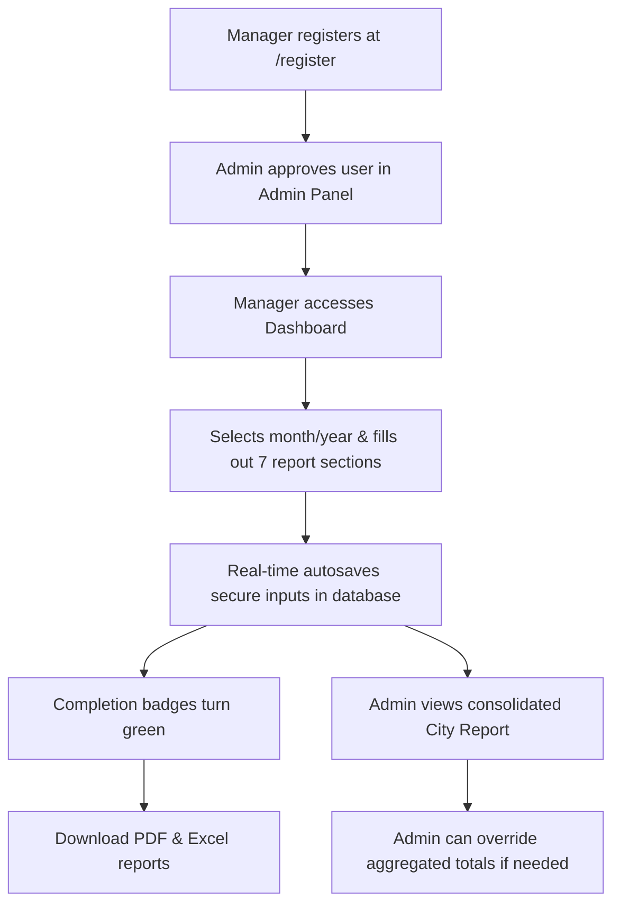

# 📊 Report Submission System (রিপোর্ট সাবমিশন সিস্টেম)

[](https://opensource.org/licenses/MIT)
[](https://nextjs.org/)
[](https://tailwindcss.com/)
[](https://supabase.com/)
[](https://www.typescriptlang.org)

An enterprise-ready, high-fidelity reporting and analytics platform designed specifically for organizational monitoring, monthly zone assessments, and consolidated city-wide data aggregation.

This system modernizes legacy reporting workflows into a fast, beautiful, and secure web application.

---

## ✨ Core Advantages (Pros)

- **⚡ Zero-Latency Autosave**: Never lose progress. Data is auto-saved locally and synced to the cloud as soon as a user shifts focus from a field (`onBlur`), backed by instant success feedback.
- **🎨 Modern 4-Theme Suite**: Features four meticulously designed themes—**Light**, **Dark**, **Solarized Light**, and **Solarized Dark**—catering to both standard preferences and high-contrast, low-strain environments.
- **🌐 Seamless Dual-Language UI**: Toggle between **Bengali (বাংলা)** and **English** instantly. The entire interface translates dynamically without page refreshes or route changes.
- **🚀 Ultra-Fast Aggregations**: By offloading complex multi-zone calculations to **PostgreSQL Views** at the database layer, the frontend renders city-wide reports instantly without heavy client-side processing.
- **🔒 Granular Row Level Security (RLS)**: Core data access is protected directly inside PostgreSQL. Managers can only view and update their own zones, while administrators retain global overwrite privileges.
- **📱 Fully Responsive Design**: Built mobile-first with sticky navigation grids, allowing field managers to submit reports comfortably from smartphones, tablets, or desktops.

---

## 🛠️ How It Works



### 1. Registration & Security Gate
New users register with email or a custom User ID. Next.js middleware enforces an **approval gate**—new accounts remain in a pending state and cannot view reports until explicitly activated by an administrator.

### 2. Guided Dashboard Navigation
The user-friendly dashboard breaks reports down into seven key sections. Each section displays a color-coded status badge to motivate managers to finish:
- ⚪ **Empty**: No data has been entered.
- 🟠 **Incomplete**: Partially filled out.
- 🟢 **Complete**: All section metrics have been accounted for.

### 3. Desktop Grids & Mobile Cards
Data input fields adapt dynamically to the screen size. On desktops, fields are structured into clean tabular grids; on mobile devices, inputs are grouped into step-by-step swipeable cards with a fixed bottom navigation bar.

### 4. Consolidated Reporting & Exports
Once zone reports are collected, administrators can access a unified city-wide report. The interface supports downloading condensed, print-ready PDF and Excel files for offline presentation.

---

## 💻 Tech Stack

- **Frontend**: Next.js 15+ (App Router) & React 19
- **Styling**: Tailwind CSS v4 & custom HSL color tokens
- **Database & Auth**: Supabase (PostgreSQL, Auth, RLS Policies, Triggers)
- **Exports**: `@react-pdf/renderer` and `exceljs`
- **Deployment**: Vercel

---

## 🚀 Quick Start

### 1. Install Dependencies
Ensure you have Node.js installed, then clone the repository and run:
```bash
npm install
```

### 2. Configure Environment Variables
Create a `.env.local` file in the root directory:
```env
NEXT_PUBLIC_SUPABASE_URL=your_supabase_url
NEXT_PUBLIC_SUPABASE_ANON_KEY=your_supabase_anon_key
SUPABASE_SERVICE_ROLE_KEY=your_supabase_service_role_key
```

### 3. Run Locally
Start the development server:
```bash
npm run dev
```
Open [http://localhost:3000](http://localhost:3000) to access the landing page.

---

## 📚 Documentation Suite & Specifications

The documentation architecture adheres to the **Master Manual + Living Trackers** pattern (ADR 001). Check out the authoritative references in the `docs/` directory:

- 📖 **[Master Technical Manual](file:///f:/WebDev/report-submission/docs/TECHNICAL_MANUAL.md)** — Comprehensive authoritative specification synthesizing system architecture, domain vocabulary, database schema, route governance, export services, developer conventions, and mobile design system tokens.
- 🗺️ **[Project Roadmap](file:///f:/WebDev/report-submission/docs/ROADMAP.md)** — Active engineering tracking and sprint sequencing (enforcing Core Reliability & Stabilization First).
- 🐛 **[Known Issues Tracker](file:///f:/WebDev/report-submission/docs/KNOWN_ISSUES.md)** — Living technical debt and bug repository.
- 🏛️ **[Architecture Decision Records](file:///f:/WebDev/report-submission/docs/ADR)** — Formal immutable records of structural engineering trade-offs.
