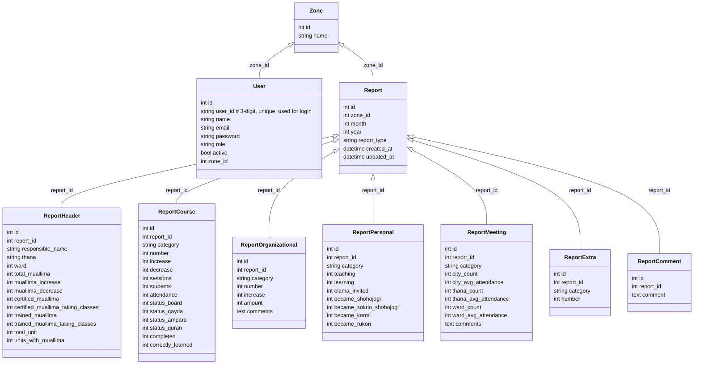
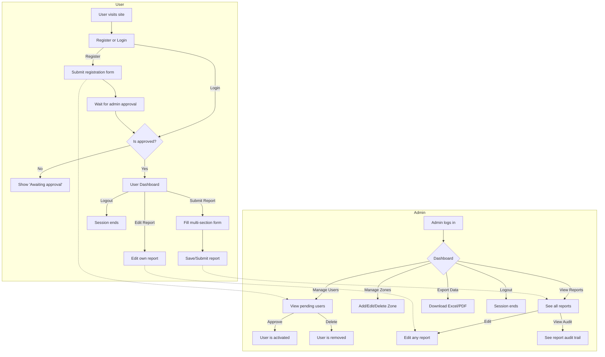

# Database Tables and Columns (Visual Table Only)



---

# Entity-Relationship Diagram (Mermaid)

```mermaid
erDiagram
    ZONE ||--o{ USER : "has"
    ZONE ||--o{ REPORT : "has"
    REPORT ||--|| REPORTHEADER : "has"
    REPORT ||--o{ REPORTCOURSE : "has"
    REPORT ||--o{ REPORTORGANIZATIONAL : "has"
    REPORT ||--o{ REPORTPERSONAL : "has"
    REPORT ||--o{ REPORTMEETING : "has"
    REPORT ||--o{ REPORTEXTRA : "has"
    REPORT ||--o{ REPORTCOMMENT : "has"

    ZONE {
        int id PK
        string name
    }
    USER {
        int id PK
        string user_id UNIQUE  # 3-digit, used for login
        string name
        string email
        string password
        string role
        bool active
        int zone_id FK
    }
    REPORT {
        int id PK
        int zone_id FK
        int month
        int year
        string report_type
        datetime created_at
        datetime updated_at
    }
    REPORTHEADER {
        int id PK
        int report_id FK
        string responsible_name
        string thana
        int ward
        int total_muallima
        int muallima_increase
        int muallima_decrease
        int certified_muallima
        int certified_muallima_taking_classes
        int trained_muallima
        int trained_muallima_taking_classes
        int total_unit
        int units_with_muallima
    }
    REPORTCOURSE {
        int id PK
        int report_id FK
        string category
        int number
        int increase
        int decrease
        int sessions
        int students
        int attendance
        int status_board
        int status_qayda
        int status_ampara
        int status_quran
        int completed
        int correctly_learned
    }
    REPORTORGANIZATIONAL {
        int id PK
        int report_id FK
        string category
        int number
        int increase
        int amount
        text comments
    }
    REPORTPERSONAL {
        int id PK
        int report_id FK
        string category
        int teaching
        int learning
        int olama_invited
        int became_shohojogi
        int became_sokrio_shohojogi
        int became_kormi
        int became_rukon
    }
    REPORTMEETING {
        int id PK
        int report_id FK
        string category
        int city_count
        int city_avg_attendance
        int thana_count
        int thana_avg_attendance
        int ward_count
        int ward_avg_attendance
        text comments
    }
    REPORTEXTRA {
        int id PK
        int report_id FK
        string category
        int number
    }
    REPORTCOMMENT {
        int id PK
        int report_id FK
        text comment
    }
```
---

# System Workflow (All Roles)


